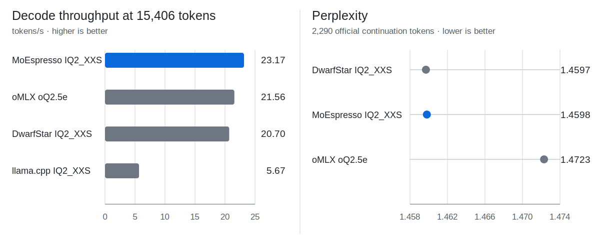
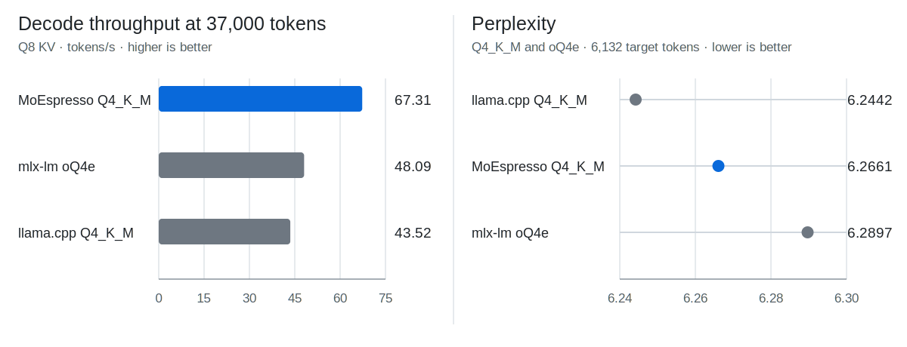

# MoEspresso

Run large Mixture-of-Experts language models well on the memory you have.

MoEspresso is a manifest-driven inference engine for a deliberately small set
of large MoE models on Apple Silicon. A package says exactly what it contains
and how it must run; the engine keeps routed experts resident when they fit and
streams them from SSD when they do not. The priority is model quality, explicit
contracts, and measured behavior.

## What makes MoEspresso different

- **SSD streaming is a first-class execution mode.** Routed expert rows are
  stored contiguously for one-read fetches, and the same expert pool covers
  both fully resident and SSD-backed execution. The package and runtime are
  designed around streaming from the beginning.
- **Defaults favor quality at long context.** A package fixes a quality-gated
  quantization recipe. Serving defaults to a broadly usable 128K context
  window. When memory cannot keep every routed expert resident,
  MoEspresso streams those experts instead of shrinking the context window.
- **K-quants and IQ-quants run inside MLX.** The public packages use
  GGML-family quantization formats through [`mlx-kquant`](#mlx-kquant-acknowledgement),
  rather than being limited to the usual affine-only MLX weight path.

**Why no MTP or DFlash?** Not yet. MoEspresso is designed as a dependable
workhorse on memory-constrained Macs. Drafting and speculative-decoding paths
consume additional unified memory that is often better spent on a
higher-quality weight mix, more usable context, or expert residency. They
remain possible future options when they demonstrate a measured net benefit
without weakening those priorities.

## In numbers

The charts show full-resident runs on an M3 Max with 40 GPU cores and 128 GB
unified memory. See [accuracy](#accuracy-focus) and [performance](#performance-focus).

**DeepSeek-V4-Flash**



**Ornith 1.0 35B**



## Supported models

| Model | Public package | Current boundary |
|---|---|---|
| DeepSeek-V4-Flash | [IQ2_XXS MoEspresso package](https://huggingface.co/steadfastgaze/DeepSeek-V4-Flash-IQ2_XXS-MoEspresso) | Tested in full-resident and SSD-streaming modes. The SSD-streaming test simulated a 64 GB memory configuration on a 128 GB host. |
| Ornith 1.0 35B | [Q4_K_M MoEspresso package](https://huggingface.co/steadfastgaze/Ornith-1.0-35B-Q4_K_M-MoEspresso) | Tested in full-resident and SSD-streaming modes. The SSD-streaming test simulated a 32 GB memory configuration on a 128 GB host. |

## Install

MoEspresso 1.0.0 requires an arm64 Apple Silicon Mac running macOS 26.2
(Tahoe) or later.

Install MoEspresso with Homebrew. The formula installs its required Python
runtime and native dependencies:

```bash
brew install steadfastgaze/tap/moespresso
```

## Download and verify a package

Install the Hugging Face CLI with Homebrew:

```bash
brew install hf
```

Then download one of the public packages into an explicit directory:

```bash
hf download steadfastgaze/DeepSeek-V4-Flash-IQ2_XXS-MoEspresso \
  --local-dir ./models/deepseek-v4-flash

hf download steadfastgaze/Ornith-1.0-35B-Q4_K_M-MoEspresso \
  --local-dir ./models/ornith-35b
```

You can verify the package correctness via:

```bash
moespresso-verify ./models/deepseek-v4-flash
moespresso-verify ./models/ornith-35b
```

Verification checks the manifest's identity and validity, every declared
member's path, size, and SHA-256, the tensor keys in every shard, and the
manifest-derived sidecars.

## Run

Serve either verified package over the OpenAI-compatible chat-completions
endpoint:

```bash
moespresso-serve ./models/deepseek-v4-flash --thinking off
moespresso-serve ./models/ornith-35b --thinking off
```

The server performs one short isolated warmup before announcing readiness,
then exposes `POST /v1/chat/completions` and `GET /health` on
`127.0.0.1:8080` by default.

```bash
curl -s http://127.0.0.1:8080/v1/chat/completions \
  -H 'Content-Type: application/json' \
  -d '{
    "messages": [{"role": "user", "content": "Explain a hash table in two sentences."}],
    "max_tokens": 256,
    "temperature": 0.7
  }'
```

Set `"stream": true` for server-sent events. Thinking-capable responses expose
`reasoning_content` separately from `content`. `moespresso-generate` provides
the same manifest-driven load and generation path for a single prompt without
starting a server.

The main serving controls are:

- `--host` and `--port` choose the listen address.
- `--thinking off|on|high|max` selects the model's own thinking mode. `high`
  is an alias of `on` for every family. Ornith takes `on` or `off` through its
  packaged template. DeepSeek-V4-Flash maps the flag onto its official encoder
  modes: `off` renders chat mode (the default), `on` renders thinking mode,
  and `max` adds the official maximum reasoning-effort preamble; `max` refuses
  loudly for families without an effort mechanism. The selection is fixed at
  startup; per-request render fields stay rejected so the served prefix
  contract is stable.
- `--prompt-cache-size` and `--prompt-cache-bytes` bound in-memory prefix-cache
  retention.
- `--startup-warmup off` deliberately restores cold first-request behavior,
  mainly for measurement.
- `--max-memory-gb` sets the expert-pool capacity planner's startup ceiling.
  Its exact meaning matters, so it is described below.
- `--max-context-tokens` selects any positive context limit up to the package's
  architecture limit. The default is 128K or the package limit, whichever is
  smaller.
- `--min-resident-experts` requires a minimum routed-expert capacity per layer
  and fails at startup when the planned pool is smaller.

## Memory policy and SSD expert streaming

MoEspresso keeps attention, norms, routers, shared experts, and other
non-routed weights resident. At startup it reserves a fixed allowance for KV
and activations, then spends the remaining planned budget on routed-expert
slots. If all experts fit, full-capacity execution is the zero-miss,
zero-on-demand-I/O case of the same pooled routed runtime after startup. If they
do not, missing experts are read into persistent slots as routing selects them.

To run either current package without on-demand expert reads during inference,
require the startup report to show full expert capacity (`capacity=256`). That
is selected automatically when the budget admits every expert row; it is not a
separate, lower- or higher-quality model graph.

For a fail-closed all-resident launch, request an explicit full prewarm:

```bash
MOESPRESSO_SSD_PREWARM_EXPERTS=all \
moespresso-serve ./models/ornith-35b --thinking off
```

This loads every expert before serving and fails when the planned pool cannot
hold all 256 experts. It exercises the same pooled routed graph as SSD
streaming; the only difference is that every row is already resident.

Serving defaults to a 128K context limit. Each package retains its larger
architecture limit, which can be selected explicitly with
`--max-context-tokens`. The operator-configured fixed KV/activation allowance
is accounted for before extra expert residency, and the planner does not infer
future context growth from incoming requests.

`--max-memory-gb` caps the input to that startup capacity calculation. It is
**not an RSS limit**. It selects a smaller or larger fixed expert pool after
subtracting the resident base, the configured fixed KV/activation allowance,
and a safety margin. The pool does not dynamically shrink as context grows, so
operators must choose the ceiling and allowance for the context workload they
intend to serve. `MOESPRESSO_SSD_KV_ALLOWANCE_GB` sets that fixed allowance
(default: 1 GiB) before startup. A capacity-capped run on a larger Mac
reproduces pool geometry and hit behavior, but its SSD miss cost can be
optimistic because macOS may retain the whole package in page cache.

See [SSD streaming](docs/ssd_streaming.md) for the capacity formula, runtime
controls, direct-read path, and measurement caveats.

## Disk KV for restart-warm sessions

The in-memory prefix cache is on by default. Disk KV is a separate opt-in tier
that checkpoints aligned prompt-cache frontiers so a later process can restore
an exact token prefix and prefill only the suffix:

```bash
MOESPRESSO_DISK_KV=frontier \
MOESPRESSO_DISK_KV_ROOT=/path/to/kv-root \
MOESPRESSO_DISK_KV_STRIDE=4096 \
moespresso-serve ./models/ornith-35b --thinking off
```

`MOESPRESSO_DISK_KV_BYTES` optionally sets an on-disk payload budget with LRU
eviction. A root has one process owner, restores are package/render/KV-policy
scoped, and every mismatch fails closed to cold prefill. See the
[disk KV contract](docs/disk_kv.md) before using it for long sessions.

## Why a MoEspresso package exists

A package is more than a collection of quantized weights:

1. Its manifest declares architecture, tensor formats, required backend
   operations, tokenizer/rendering identity, content-addressed file identities,
   and a provenance chain through the plan and producer that created it.
2. Each routed layer stores one `uint8 [n_experts, row_bytes]` bundle. Row `e`
   is expert `e`'s complete gate, up, and down payload laid out contiguously,
   so one missing expert can be fetched with one contiguous read instead of a
   scatter of projection reads.
3. The bundles live per layer inside ordinary safetensors shards; there is no
   single global expert file. Shard metadata carries the exact offsets, shapes,
   dtypes, codecs, and component order needed to index each row without reading
   weight data.

That layout is an engine/package co-design: the runtime knows exactly how to
keep the all-resident case fast and how to turn the same rows into SSD-backed
expert slots. A package meant only as a generic weight container would not
provide that contract. Direct GGUF loading or a more interchangeable package
form may be supported in the future, but neither is the current runtime input.

The full contract is in [package format](docs/package_format.md).

## Accuracy focus

Package, cache, attention, routing, and quantized-math changes are promoted
through model-specific token or logit comparisons and must exercise the intended
runtime path. DeepSeek Q0/Q1 fixtures are public material carried from the
DwarfStar suite.
Provider-derived Q2 continuations and top-logprob captures remain private by
design.

The DeepSeek comparison uses the same 100 thinking-off official API
continuations, containing 2,290 target tokens, as the textual oracle for all
three local artifacts:

| DeepSeek artifact / engine | Perplexity (lower is better) |
|---|---:|
| MoEspresso IQ2_XXS / MoEspresso 1.0.0 | 1.4598 |
| DwarfStar IQ2_XXS / DwarfStar `80ebbc3` | 1.4597 |
| Jundot oQ2.5e / oMLX 0.5.1 | 1.4723 |

The DwarfStar and MoEspresso packages share the
GGUF's routed-expert wire bytes, while dense tensors, runtime graphs, and
logit reductions differ. Their perplexities nevertheless coincide to three
decimals. Across the 100 cases, the lower-loss result split 52/48 between them,
which is not a defensible quality ranking.
The provider returned `0.0` for every selected-token logprob in this capture.

Ornith has a separate nine-item served gate spanning reasoning,
agentic coding, and long-context recall.

The public Ornith NLL matrix complements that served gate with the same 6,132
teacher-forced target tokens and all 248,320 output logits in every arm:

| Ornith artifact / engine | Perplexity (lower is better) |
|---|---:|
| GGUF Q8_0 baseline / llama.cpp `6eddde0` | 6.1901 |
| GGUF Q4_K_M / llama.cpp `6eddde0` | 6.2442 |
| MoEspresso Q4_K_M / MoEspresso 1.0.0 | 6.2661 |
| Jundot oQ4e / mlx-lm 0.31.3 | 6.2897 |

The MoEspresso and mlx-lm teacher-forced measurements do not use a generation
KV cache. The llama.cpp scorers use a fresh F16 KV cache for each window.

Further guarantees and limitations are documented in
[DeepSeek quality](docs/deepseek_v4_quality.md),
[Ornith quality](docs/ornith_quality.md), and the shared
[correctness ladder](docs/correctness_ladder.md).

## Performance focus

The comparison matrix was measured on an M3 Max with 40 GPU cores and 128 GB
unified memory. Every cell is the median of three fresh-process runs with an
8-token prewarm and 256 measured output tokens. Engines were left-rotated
between rounds; AC power, normal thermal state, greedy decoding, temperature
0, vision off, and MTP/DFlash/speculation off were enforced. Values are
**decode throughput / TTFT-derived prompt throughput**, in tokens per second.

| DeepSeek context | MoEspresso | DwarfStar | llama.cpp | oMLX |
|---:|---:|---:|---:|---:|
| 3,844 | 24.73 / 263.55 | 24.63 / 281.30 | 6.03 / 180.79 | 22.67 / 226.51 |
| 7,698 | 23.82 / 223.85 | 21.08 / 256.08 | 5.87 / 170.30 | 22.66 / 219.33 |
| 15,406 | 23.17 / 215.78 | 20.70 / 258.66 | 5.67 / 148.93 | 21.56 / 183.73 |

| Ornith context | MoEspresso Q8 KV | mlx-lm Q8 KV | llama.cpp Q8 KV |
|---:|---:|---:|---:|
| 3,969 | 84.81 / 1,149.51 | 67.39 / 1,578.30 | 62.36 / 1,129.05 |
| 8,191 | 83.78 / 1,110.66 | 63.33 / 1,496.54 | 58.74 / 1,058.73 |
| 37,000 | 67.31 / 820.00 | 48.09 / 1,101.59 | 43.52 / 693.02 |

MoEspresso and mlx-lm use affine Q8 with group size 64. llama.cpp uses `q8_0` K
and V with group size 32. MoEspresso and llama.cpp use Q4_K_M weights from the
same GGUF lineage. mlx-lm uses Jundot oQ4e weights.

A separate matched mlx-lm diagnostic at 8,191 tokens measured 69.96 tok/s with
raw BF16 KV and 63.33 tok/s with affine Q8 KV. Raw BF16 uses substantially more
attention-cache storage, so Q8 remains the product comparison.

Engine versions are MoEspresso `1.0.0`, mlx-lm `0.31.3`, oMLX `0.5.1`,
DwarfStar at commit `80ebbc3`, and llama.cpp at commit `6eddde0`.

Read
[DeepSeek speed](docs/deepseek_v4_speed.md),
[Ornith speed](docs/ornith_speed.md), and the exact acquisition, prewarm,
thermal, timing, repeat, and evidence protocol in
[benchmark reproduction](docs/benchmark_reproduction.md).

## Documentation

- [Documentation map](docs/README.md): model, package, runtime, quality, and
  benchmark references.
- [Developer guide](DEVGUIDE.md): lifecycle, source map, entry points, and test
  commands.
- [Contributor guide](AGENTS.md): working rules and invariants.
- [DeepSeek package recipe](docs/deepseek_v4_package_recipe.md) and
  [Ornith package guide](docs/ornith_package.md): developer-facing package
  construction, including Ornith's remaining public source-adapter gap.
- [Resident runtime](docs/runtime_resident.md),
  [SSD streaming](docs/ssd_streaming.md), and
  [package format](docs/package_format.md): the core implementation contracts.

## Acknowledgements

MoEspresso would not exist without the ideas, code, measurements, and examples
of a large community. This list cannot be exhaustive, but these influences were
fundamental:

- [antirez](https://github.com/antirez)'s
  [DwarfStar](https://github.com/antirez/ds4) was more than a reference engine.
  MoEspresso began independently, but adding DeepSeek-V4-Flash against a
  serious, narrow, quality-and-speed-focused baseline gave the project a
  product signal and a standard worth refining toward.
- <a id="mlx-kquant-acknowledgement"></a>[Asher Feldman](https://github.com/asher)'s
  [mlx-kquant](https://github.com/asher/mlx-kquant) made K-quant wire formats
  practical inside MLX. Finding that work was a turning point: after the model
  graph had been checked seam by seam but low-bit native weights still failed
  behavior gates, this extension raised the quantization quality on MLX.
- Two projects from the broader MLX inference community shaped MoEspresso in
  different ways. [Jinho Jang](https://github.com/jjang-ai)'s
  [JANG](https://github.com/jjang-ai/jangq) was a rich source of ideas,
  especially in its willingness to explore new quantization schemes.
  MoEspresso still supports a distinct manifest-driven TurboQuant path built
  with JANG's codec components, although neither current public package uses
  it. JANG also remains part of the live DeepSeek-V4-Flash path through its MLX
  model graph and cache primitives. [Jundot](https://github.com/jundot)'s
  [oMLX](https://github.com/jundot/omlx) brings continuous batching, tiered KV
  caching, and oQ mixed-precision work. It provided an important performance
  reference for Ornith and may influence this project further.
- [Iwan Kawrakow](https://github.com/ikawrakow) and
  [ik_llama.cpp](https://github.com/ikawrakow/ik_llama.cpp) pushed IQ
  quantization and specialized inference far enough to show how much codec and
  kernel design can matter beyond a nominal bit count.
- Apple and the [MLX](https://github.com/ml-explore/mlx) and
  [mlx-lm](https://github.com/ml-explore/mlx-lm) communities provided the array
  framework, unified-memory model, graph runtime, model components, and
  generation ecosystem on which MoEspresso is built.

## License

Dual-licensed under Apache 2.0 (`LICENSE-APACHE-2.0`) or MIT (`LICENSE-MIT`).
