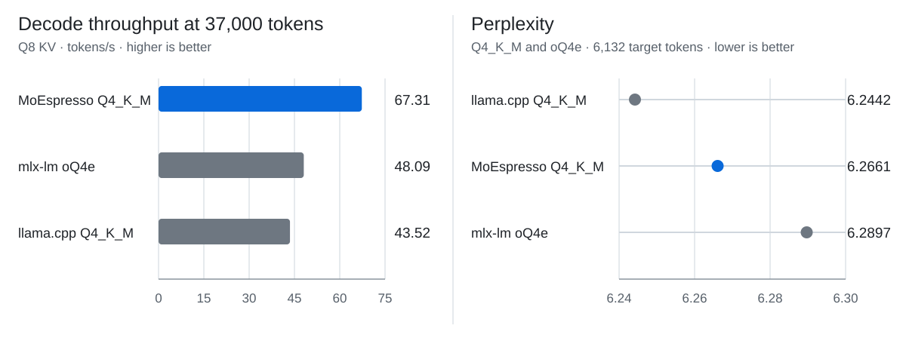

# MoEspresso

Run large Mixture-of-Experts language models well on the memory you have.

MoEspresso is an inference engine for a deliberately small set
of large MoE models on Apple Silicon. A package says exactly what it contains
and how it must run, and the runtime builds the model from those declared
facts. The priority is model quality, explicit contracts, and measured
behavior.

## What makes MoEspresso different

- **Routed experts keep their own quantization format inside MLX.** The
  DeepSeek-V4-Flash package stores its routed experts in the IQ_K formats and
  decodes them through [`mlx-iqk`](#mlx-iqk-acknowledgement); its dense side is
  q6_K through [`mlx-kquant`](#mlx-kquant-acknowledgement), which also carries
  the K-quant routed experts of the Ornith package. A TurboQuant path is
  implemented as well, though no published package uses it. None of this is
  limited to the affine-only MLX weight path.
- **SSD expert streaming is an execution mode of the pooled routed runtime.**
  Routed expert rows are stored contiguously for one-read fetches, and one
  expert pool covers both fully resident and SSD-backed execution. Streaming
  covers the K-quant, TurboQuant, and IQ_K routed formats.
- **Defaults favor quality at long context.** A package fixes a quality-gated
  quantization recipe. Serving defaults to a broadly usable 128K context
  window, and on the pooled runtime a memory shortfall streams routed experts
  instead of shrinking that window.
- **Speculative decoding ships and engages on its own.** A package can declare
  a bundled drafter. The DeepSeek-V4-Flash package carries one, and serving
  enables it when the memory budget covers it. See
  [speculative decoding](#speculative-decoding).

## In numbers

**DeepSeek-V4-Flash**, full-resident on an M3 Max with 40 GPU cores and 128 GB
unified memory. Lower NLL and perplexity are better; higher first-token
agreement and decode throughput are better:

| Package and runtime | Drafter-free weights | WikiText mean NLL | WikiText PPL | API-continuation mean NLL | API first-token agreement | 37K decode, drafter off |
|---|---:|---:|---:|---:|---:|---:|
| MoEspresso 2.37 bpw / MoEspresso | 84.35 GB | 1.71466 | 5.5548 | 0.39634 | 66/100 | 22.424 tok/s |
| antirez IQ2_XXS / DS4 | 86.72 GB | 1.76824 | 5.8605 | 0.41517 | 54/100 | 22.806 tok/s |
| Unsloth UD-IQ2_XXS / llama.cpp | 90.86 GB | 1.71695 | 5.5675 | 0.36224 | 62/100 | 9.113 tok/s |

**MoEspresso was not calibrated on this WikiText test panel.** See
[accuracy](#accuracy-focus), [performance](#performance-focus), and the
[comparison protocol](docs/benchmark_reproduction.md#deepseek-v4-flash-quality-comparison).

**Ornith 1.0 35B**, full-resident on an M3 Max with 40 GPU cores and 128 GB
unified memory:



## Supported models

| Model | Public package | Serving mode |
|---|---|---|
| DeepSeek-V4-Flash-0731 | [DeepSeek-V4-Flash-0731-2.37bpw-MoEspressoV2](https://huggingface.co/steadfastgaze/DeepSeek-V4-Flash-0731-2.37bpw-MoEspressoV2) | Built from the 0731 release. 84.35 GB (78.56 GiB) of model shards, 90.74 GB (84.51 GiB) with the bundled DSpark drafter. IQ_K routed experts use the pooled runtime in full-resident or SSD-streaming mode. |
| Ornith 1.0 35B | [Ornith-1.0-35B-Q4_K_M-MoEspresso](https://huggingface.co/steadfastgaze/Ornith-1.0-35B-Q4_K_M-MoEspresso) | K-quant routed experts on the pooled routed runtime. Tested in full-resident and SSD-streaming modes. The SSD-streaming test simulated a 32 GB memory configuration on a 128 GB host. |

The DeepSeek-V4-Flash package is a whole-model 2.37 bits per weight over the
served model's 284.335e9 parameters, with the drafter excluded from both sides
of that ratio. Its routed experts average 2.2491 bits per weight as a mix of
IQ2_KS on 89 of the 129 routed-expert tensors and IQ2_K on the other 40, and
they hold 77.88 GB of the model shards. The remaining 6.47 GB is the dense
side, stored in q6_K.

## Install

MoEspresso 2.1.1 requires an arm64 Apple Silicon Mac running macOS 26.2
(Tahoe) or later.

Install MoEspresso with Homebrew. The formula installs its required Python
runtime and native dependencies:

```bash
brew install steadfastgaze/tap/moespresso
```

Check the installed release and list its user-facing commands:

```bash
moespresso --version
moespresso --help
```

## Quick start

Install the Hugging Face CLI with Homebrew:

```bash
brew install hf
```

Download the Ornith package into an explicit directory:

```bash
hf download steadfastgaze/Ornith-1.0-35B-Q4_K_M-MoEspresso \
  --local-dir ./models/ornith-35b
```

Or download the DeepSeek-V4-Flash package:

```bash
hf download steadfastgaze/DeepSeek-V4-Flash-0731-2.37bpw-MoEspressoV2 \
  --local-dir ./models/deepseek-v4-flash
```

You can verify the package:

```bash
moespresso verify ./models/ornith-35b
```

Verification checks the manifest's identity and validity, every declared
member's path, size, and SHA-256, the tensor keys in every shard, and the
manifest-derived sidecars. Start the local server:

```bash
moespresso serve ./models/ornith-35b --thinking off
```

The server performs one short isolated warmup before announcing readiness,
then exposes `POST /v1/chat/completions` and `GET /health` on
`127.0.0.1:8080` by default.

Leave that terminal running. With OpenCode installed, configure and start it
from a second terminal:

```bash
moecode() {
  OPENCODE_CONFIG_CONTENT='{
    "provider": {
      "moespresso": {
        "npm": "@ai-sdk/openai-compatible",
        "name": "MoEspresso (local)",
        "options": { "baseURL": "http://127.0.0.1:8080/v1" },
        "models": {
          "MoEspresso": {
            "name": "model @ MoEspresso",
            "temperature": true,
            "interleaved": "reasoning_content",
            "limit": { "context": 131072, "output": 32768 }
          }
        }
      }
    },
    "model": "moespresso/MoEspresso",
    "small_model": "moespresso/MoEspresso"
  }' opencode "$@"
}

moecode
```

The model declaration lets OpenCode forward an agent temperature and preserve
assistant reasoning in `reasoning_content` across turns. Thinking remains a
server-startup choice through `moespresso serve --thinking`; the declaration
does not advertise per-request reasoning-effort variants.

The main serving controls are:

- `--host` and `--port` choose the listen address.
- `--thinking off|on|high|max` selects the model's own thinking mode. `high`
  is an alias of `on` for every family. Ornith takes `on` or `off` through its
  packaged template. DeepSeek-V4-Flash maps the flag onto its official encoder
  modes: `off` renders chat mode (the default), `on` renders thinking mode,
  and `max` adds the official maximum reasoning-effort preamble; `max` refuses
  loudly for families without an effort mechanism. The selection is fixed at
  startup; per-request render fields stay rejected so the served prefix
  contract is stable.
- `--prompt-cache-size` and `--prompt-cache-bytes` bound in-memory prefix-cache
  retention.
- `--startup-warmup off` deliberately restores cold first-request behavior,
  mainly for measurement.
- `--max-memory-gb` sets the expert-pool capacity planner's startup ceiling.
  Its exact meaning matters, so it is described below.
- `--max-context-tokens` selects any positive context limit up to the package's
  architecture limit. The default is 128K or the package limit, whichever is
  smaller.
- `--min-resident-experts` sets a floor on the pooled routed runtime's
  per-layer expert capacity and fails at startup when the loaded capacity is
  smaller. A package whose runtime reports no expert pool refuses to start
  under this flag.

## Memory policy and expert residency

MoEspresso keeps attention, norms, routers, shared experts, and other
non-routed weights resident. What happens to the routed side depends on the
package's routed format.

The pooled routed runtime carries the K-quant, TurboQuant, and IQ_K routed
formats. The DeepSeek-V4-Flash package uses it for IQ_K experts, while the
Ornith package and the earlier DeepSeek K-quant packages use it for K-quant
experts. At startup it reserves a fixed allowance for KV and activations, then
spends the remaining planned budget on routed-expert slots. If all 256 experts
fit, the default startup policy loads every row and full-capacity execution is
the zero-miss, zero-on-demand-I/O case of the same pooled graph. If they do not,
missing experts are read into persistent slots as routing selects them.

To run a pooled package without on-demand expert reads during inference,
require the startup report to show full expert capacity (`capacity=256`). That
is selected automatically when the budget admits every expert row; it is not a
separate, lower- or higher-quality model graph.

For a fail-closed all-resident launch, request an explicit full prewarm:

```bash
MOESPRESSO_SSD_PREWARM_EXPERTS=all \
moespresso serve ./models/ornith-35b --thinking off
```

This loads every expert before serving and fails when the planned pool cannot
hold all 256 experts. It exercises the same pooled routed graph as SSD
streaming; the only difference is that every row is already resident.

Serving defaults to a 128K context limit. Each package retains its larger
architecture limit, which can be selected explicitly with
`--max-context-tokens`. The operator-configured fixed KV/activation allowance
is accounted for before extra expert residency, and the planner does not infer
future context growth from incoming requests.

`--max-memory-gb` caps the input to that startup capacity calculation. It is
**not an RSS limit**. It selects a smaller or larger base expert-pool capacity
after subtracting the resident base, the configured fixed KV/activation
allowance, and a safety margin. Serving can grow selected layers after a
completed request when the adaptive-growth and replacement-memory budgets
allow it. Pools never shrink as context grows, so operators must choose the
ceiling and allowance for the context workload they intend to serve.
`MOESPRESSO_SSD_KV_ALLOWANCE_GB` sets that fixed allowance (default: 1 GiB)
before startup. A capacity-capped run on a larger Mac reproduces pool geometry
and hit behavior, but its SSD miss cost can be optimistic because macOS may
retain the whole package in page cache.

See [SSD streaming](docs/ssd_streaming.md) for the capacity formula, runtime
controls, direct-read path, and measurement caveats.

## Speculative decoding

A DeepSeek-V4-Flash package can declare a draft model as an optional bundled
component. The published package carries DeepSeek's DSpark drafter, and
serving enables it when the package is fully resident, every declared
component file is present, and the wired-memory budget covers the weights, the
drafter, cache state at the served context limit, and the per-request working
set. When one of those does not hold, serving stays plain and prints the
reason; automatic selection never refuses startup. The loop is lossless by
rule: a proposed token is kept only when the target model's own verification
accepts it, so no unverified token is ever emitted.

```bash
MOESPRESSO_DS4_DRAFTER=off moespresso serve ./models/deepseek-v4-flash  # no drafting
```

Use a separately downloaded DSpark sidecar by passing its directory to both
verification and serving:

```bash
moespresso verify ./models/deepseek-v4-flash --drafter ./models/dspark
moespresso serve ./models/deepseek-v4-flash --drafter ./models/dspark
```

The command recognizes the sidecar family from the manifest at the supplied
root. This release accepts DSpark on the external command surface and refuses
DFlash or MTP sidecars with a clear error. `--drafter` overrides
`MOESPRESSO_DS4_DRAFTER` and bundled automatic selection. The source tree
retains the DFlash and MTP implementations for future model packages.

DSpark requests keep the in-memory prefix cache and the disk checkpoint tier
described below, so a follow-up turn over a shared prefix resumes speculation
instead of prefilling that prefix again. When the stored drafter state cannot
be reused, the validated prompt cache still serves the request plainly.
DFlash serves from a fresh per-request cache.

See [speculative decoding](docs/speculative_decoding.md) for the drafter
protocol, the families and their sidecars, the adaptive scheduler, the memory
each sidecar costs, and the correctness contract.

## Disk KV for restart-warm and cross-session resume

The in-memory prefix cache is always on. The disk KV tier checkpoints
aligned prompt-cache frontiers so a later process, or a new session sharing
a long prompt prefix (an agent client's fixed system prompt and tools),
restores an exact token prefix and prefills only the suffix. Serving enables
it by default under `~/.cache/moespresso/disk_kv/<package>` with an 8 GiB
LRU byte budget per package, a 1024-token stride, and a 16k-token
write-depth cap (checkpoints cover the shared-prefix region; deep
conversation tails are not snapshotted):

```bash
moespresso serve ./models/ornith-35b --thinking off
MOESPRESSO_DISK_KV=off moespresso serve ./models/ornith-35b   # memory-only
```

`MOESPRESSO_DISK_KV_ROOT`, `MOESPRESSO_DISK_KV_STRIDE`,
`MOESPRESSO_DISK_KV_BYTES` (`unlimited` disables eviction), and
`MOESPRESSO_DISK_KV_WRITE_DEPTH` (`unlimited` snapshots any depth) override
the defaults. A root has one process owner, restores are package/render/KV-policy
scoped, and a prompt-cache checkpoint that does not match fails closed to cold
prefill. Deleting
`~/.cache/moespresso` is always safe. See the
[disk KV contract](docs/disk_kv.md) for the full guarantees.

## Why a MoEspresso package exists

A package is more than a collection of quantized weights:

1. Its manifest declares architecture, tensor formats, required backend
   operations, tokenizer/rendering identity, content-addressed file identities,
   and a provenance chain through the plan and producer that created it.
2. Each routed layer stores one `uint8 [n_experts, row_bytes]` bundle. Row `e`
   is expert `e`'s complete gate, up, and down payload laid out contiguously,
   so one missing expert can be fetched with one contiguous read instead of a
   scatter of projection reads.
3. The bundles live per layer inside ordinary safetensors shards; there is no
   single global expert file. Shard metadata carries the exact offsets, shapes,
   dtypes, codecs, and component order needed to index each row without reading
   weight data.

That layout is an engine/package co-design: the runtime knows exactly how to
keep the all-resident case fast and, on the pooled routed formats, how to turn
the same rows into SSD-backed expert slots. A package meant only as a generic
weight container would not provide that contract. Direct GGUF loading or a more
interchangeable package form may be supported in the future, but neither is the
current runtime input.

The full contract is in [package format](docs/package_format.md).

## Accuracy focus

Package, cache, attention, routing, and quantized-math changes are promoted
through model-specific token or logit comparisons and must exercise the intended
runtime path. DeepSeek Q0/Q1 fixtures are public material carried from the
DwarfStar suite.
Provider-derived Q2 continuations and top-logprob captures remain private by
design.

### DeepSeek-V4-Flash release gates

The DeepSeek-V4-Flash results below were measured on the published artifact
against the DeepSeek-V4-Flash 0731 release, at full residency with the drafter
off:

| Check | Scope | Result |
|---|---|---|
| Renderer and tokenizer goldens | 34 fixed cases | 34/34 |
| Greedy selected-token identity | 14 greedy decisions across five fixed prompts, against the official API | 9/14 |
| Official continuation loss | 100 prompts, 2,313 target tokens, teacher-forced | average NLL 0.3963 |
| Step-level agreement | the same 100 prompts | 87.42 percent |
| First token | the same 100 prompts | 66/100 |
| Long-context fact recall | 16 facts in a 30,000-token-class prompt | 16/16 |
| Served KL panels | calibration, held-out, and WikiText-test probes against the bf16 reference | valid, 0 findings |
| WikiText test-split perplexity, all-position release gate | 32 windows, 65,504 targets | 6.4774 |

Two reference points frame those numbers. The official API's own pass-to-pass
step-level agreement on the same 100 prompts is 89.67 percent, and the package
sits about 2.3 points below that reproducibility reading. The bf16 teacher's
perplexity on the same 32 WikiText windows is 4.8886.

### Ornith

Ornith has a separate nine-item served gate spanning reasoning,
agentic coding, and long-context recall.

The public Ornith NLL matrix complements that served gate with the same 6,132
teacher-forced target tokens and all 248,320 output logits in every arm:

| Ornith artifact / engine | Perplexity (lower is better) |
|---|---:|
| GGUF Q8_0 baseline / llama.cpp `6eddde0` | 6.1901 |
| GGUF Q4_K_M / llama.cpp `6eddde0` | 6.2442 |
| MoEspresso Q4_K_M / MoEspresso 1.0.0 | 6.2661 |
| Jundot oQ4e / mlx-lm 0.31.3 | 6.2897 |

The MoEspresso and mlx-lm teacher-forced measurements do not use a generation
KV cache. The llama.cpp scorers use a fresh F16 KV cache for each window.

Further guarantees and limitations are documented in
[DeepSeek quality](docs/deepseek_v4_quality.md),
[Ornith quality](docs/ornith_quality.md), and the shared
[correctness ladder](docs/correctness_ladder.md).

## Performance focus

The DeepSeek-V4-Flash rows were measured on the published artifact, on a
128 GB unified-memory configuration: ten alternating fresh-process arms at a
3,844-token prompt, greedy decoding, the disk KV tier off
(`MOESPRESSO_DISK_KV=off`), thermal gating before and after every arm, an
8-token warmup request ahead of each measured request, and every arm exact
against the package's 38-token reference rail. The target used the pooled
runtime at capacity 256 with all 129 projection pools identity-mapped and no
request-time expert I/O.

| DeepSeek-V4-Flash, 2.37 bpw package | Drafter off | Drafter on |
|---|---|---|
| Decode | 26.473-27.562 tok/s, median 26.591 | 32.479-32.724 tok/s, median 32.627 |
| Request peak | 86.75 GiB (93.15 GB) | 92.63 GiB (99.46 GB) |
| Load | 23.0-23.2 s | 29.6-30.2 s |

Every drafter-on arm read above every drafter-off arm, and the smallest gap
between the two sets is 4.92 tok/s. The median gain is 22.70 percent.

The 37,000-token product-stack comparison is summarized [in numbers](#in-numbers).
Exact artifacts, engine revisions, prompt hashes, cache controls, thermal
readings, and per-run results are in [DeepSeek speed](docs/deepseek_v4_speed.md).

The Ornith comparison matrix was measured on an M3 Max with 40 GPU cores and
128 GB unified memory. Every cell is the median of three fresh-process runs
with an 8-token prewarm and 256 measured output tokens. Engines were
left-rotated between rounds; AC power, normal thermal state, greedy decoding,
temperature 0, vision off, and speculation off were enforced. Runs used the
memory-only cache path: the disk KV tier, on by default when serving, was
disabled (`MOESPRESSO_DISK_KV=off`). Values are
**decode throughput / TTFT-derived prompt throughput**, in tokens per second.

| Ornith context | MoEspresso Q8 KV | mlx-lm Q8 KV | llama.cpp Q8 KV |
|---:|---:|---:|---:|
| 3,969 | 84.81 / 1,149.51 | 67.39 / 1,578.30 | 62.36 / 1,129.05 |
| 8,191 | 83.78 / 1,110.66 | 63.33 / 1,496.54 | 58.74 / 1,058.73 |
| 37,000 | 67.31 / 820.00 | 48.09 / 1,101.59 | 43.52 / 693.02 |

MoEspresso and mlx-lm use affine Q8 with group size 64. llama.cpp uses `q8_0` K
and V with group size 32. MoEspresso and llama.cpp use Q4_K_M weights from the
same GGUF lineage. mlx-lm uses Jundot oQ4e weights. The MoEspresso column was
produced by engine `1.0.0`; the compared engines are mlx-lm `0.31.3` and
llama.cpp at commit `6eddde0`.

A separate matched mlx-lm diagnostic at 8,191 tokens measured 69.96 tok/s with
raw BF16 KV and 63.33 tok/s with affine Q8 KV. Raw BF16 uses substantially more
attention-cache storage, so Q8 remains the product comparison.

Read
[DeepSeek speed](docs/deepseek_v4_speed.md),
[Ornith speed](docs/ornith_speed.md), and the exact acquisition, prewarm,
thermal, timing, repeat, and evidence protocol in
[benchmark reproduction](docs/benchmark_reproduction.md).

## Documentation

- [Documentation map](docs/README.md): model, package, runtime, quality, and
  benchmark references.
- [Developer guide](DEVGUIDE.md): lifecycle, source map, entry points, and test
  commands.
- [Contributor guide](AGENTS.md): working rules and invariants.
- [DeepSeek package recipe](docs/deepseek_v4_package_recipe.md) and
  [Ornith package guide](docs/ornith_package.md): developer-facing package
  construction, including Ornith's remaining public source-adapter gap.
- [Resident runtime](docs/runtime_resident.md),
  [SSD streaming](docs/ssd_streaming.md), and
  [package format](docs/package_format.md): the core implementation contracts.
- [Speculative decoding](docs/speculative_decoding.md): drafter families and
  sidecars, the draft/verify loop, the scheduler, cache reuse, and memory.

## Acknowledgements

MoEspresso would not exist without the ideas, code, measurements, and examples
of a large community. This list cannot be exhaustive, but these debts are
concrete:

- <a id="mlx-iqk-acknowledgement"></a>[Iwan Kawrakow](https://github.com/ikawrakow)
  wrote the quantization formats MoEspresso serves. The
  DeepSeek-V4-Flash package stores its routed experts in his IQ_K formats, and
  the bytes are produced by his quantization algorithms, published in
  [ik_llama.cpp](https://github.com/ikawrakow/ik_llama.cpp) and vendored at a
  pinned commit with their upstream notices in
  [mlx-iqk](https://github.com/steadfastgaze/mlx-iqk), which the release
  installs from PyPI at `0.1.2` and which carries the Metal decode kernels and
  the k-contiguous relayout the routed path reads. The Ornith package and the
  earlier DeepSeek packages ship the k-quants, which he designed and
  implemented in llama.cpp. MoEspresso's
  Metal serving of the IQ_K formats is this project's own implementation, and
  its correctness target is his: the served bytes reconstruct bit for bit what
  his CPU dequantizers produce.
- [Georgi Gerganov](https://github.com/ggerganov)'s
  [ggml](https://github.com/ggml-org/ggml) and
  [llama.cpp](https://github.com/ggml-org/llama.cpp) built the ground this work
  stands on: the GGUF container MoEspresso's recipe importers read, the
  block-quantization ecosystem the served formats belong to, and a reference
  engine that anchors the published speed and perplexity comparisons.
- <a id="mlx-kquant-acknowledgement"></a>[Asher Feldman](https://github.com/asher)'s
  [mlx-kquant](https://github.com/asher/mlx-kquant) made K-quant wire formats
  practical inside MLX. Finding that work was a turning point: after the model
  graph had been checked seam by seam but low-bit native weights still failed
  behavior gates, this extension raised the quantization quality on MLX. The
  release installs `0.3.0` from the fork at
  [steadfastgaze/mlx-kquant](https://github.com/steadfastgaze/mlx-kquant),
  revision `6fbfd4f5`, which carries the kernel work this project's serving
  paths depend on; the revision behind the published Ornith rows is recorded in
  [benchmark reproduction](docs/benchmark_reproduction.md).
- [Bartowski](https://github.com/bartowski1182)'s `calibration_datav5` corpus
  (pinned gist `82ae9b520227f57d79ba04add13d0d0d`, raw commit `14543ac`) is the
  training spine of the DeepSeek-V4-Flash calibration set; his gist in turn
  credits Dampf, Kalomaze, and edaddario's datasets. His published GGUF
  quantizations also serve as external baselines in the benchmark
  documentation.
- [turboderp](https://github.com/turboderp-org)'s
  [exllamav3](https://github.com/turboderp-org/exllamav3) (pinned at commit
  `0b9745c`) contributes the `technical.utf8` calibration file and the held-out
  `c4.utf8` and `code.utf8` probes.
- [DeepSeek](https://huggingface.co/deepseek-ai) trained and released
  DeepSeek-V4-Flash and its DSpark drafter checkpoint under the MIT license.
  The package repackages those weights, and the prompt renderer adapts the
  upstream encoding module, as recorded in `THIRD-PARTY-NOTICES`.
- [froggeric](https://huggingface.co/froggeric)'s Qwen-Fixed-Chat-Templates
  (Apache-2.0, pinned at v19) provides the vendored Ornith chat template;
  MoEspresso's modifications are described in `THIRD-PARTY-NOTICES`.
- [Jinho Jang](https://github.com/jjang-ai)'s
  [JANG](https://github.com/jjang-ai/jangq) (Apache-2.0) was a rich source of
  ideas, especially in its willingness to explore new quantization schemes.
  MoEspresso supports a distinct manifest-driven TurboQuant path built with
  JANG's codec components, and JANG remains part of the live
  DeepSeek-V4-Flash path through its MLX model graph and cache primitives.
  Several MoEspresso kernels adapt JANG kernel sources, as recorded in
  `THIRD-PARTY-NOTICES`.
- [antirez](https://github.com/antirez)'s
  [DwarfStar](https://github.com/antirez/ds4) was more than a reference engine.
  MoEspresso began independently, but adding DeepSeek-V4-Flash against a
  serious, narrow, quality-and-speed-focused baseline gave the project a
  product signal and a standard worth refining toward.
- [Jundot](https://github.com/jundot)'s
  [oMLX](https://github.com/jundot/omlx) brings continuous batching, tiered KV
  caching, and oQ mixed-precision work. It provided an important performance
  reference and may influence this project further.
- Apple and the [MLX](https://github.com/ml-explore/mlx) and
  [mlx-lm](https://github.com/ml-explore/mlx-lm) communities provided the array
  framework, unified-memory model, graph runtime, model components, and
  generation ecosystem on which MoEspresso is built.

## License

Dual-licensed under Apache 2.0 (`LICENSE-APACHE-2.0`) or MIT (`LICENSE-MIT`),
at your option.

`THIRD-PARTY-NOTICES` is the per-file attribution record for third-party code
that ships inside this repository, with the upstream revision each derivation
was taken from. It travels with the source, the wheel, and the source
distribution, and a redistribution must keep all three files together.
